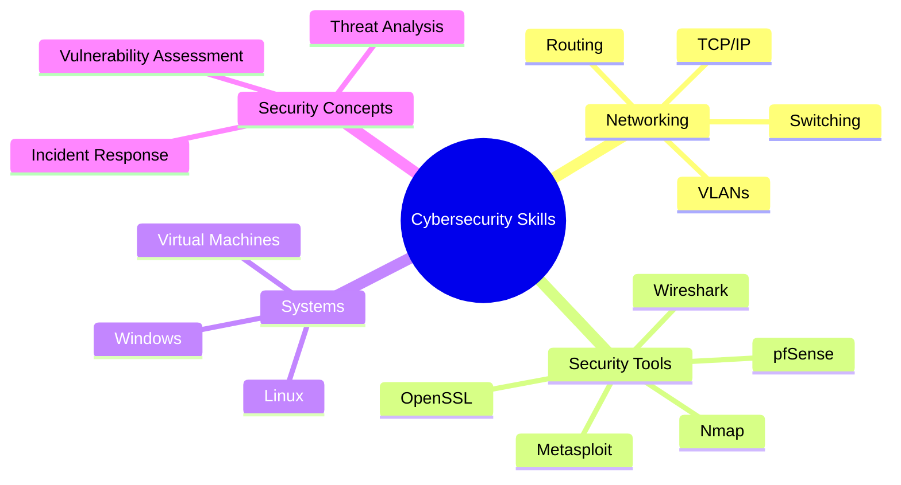

# 👨‍💻 Arya Patel - Cybersecurity Portfolio

---

## 🌐 About Me

I am a Computer Science graduate passionate about **cybersecurity, networking, and incident response**.
I enjoy understanding how systems communicate, how attacks happen, and how to defend IT infrastructures using security tools and best practices.

---

## 🎯 Career Objective

Seeking opportunities as a **SOC Analyst / Cybersecurity Analyst (Entry-Level)** in Canada, where I can apply my knowledge of networking, security monitoring, and incident response.

---

## 🛠️ Technical Skills

### 🔐 Cybersecurity & Networking

* TCP/IP, DNS, DHCP, VLANs
* Routing & Switching fundamentals
* Network traffic analysis
* Vulnerability assessment basics

### 🧰 Security Tools

* Nmap (Network Scanning)
* Wireshark (Packet Analysis)
* Metasploit (Exploitation basics)
* OpenSSL (Encryption & certificates)
* pfSense (Firewall basics)

### 💻 Systems & Platforms

* Linux (Ubuntu, CLI operations)
* Windows Administration
* VirtualBox / VMware (Virtual Labs)

### 📊 Other Skills

* Incident Response basics
* Troubleshooting network issues
* Analytical thinking & problem solving
* Team collaboration & communication

---

## 📂 Projects

* 🔍 Network Scanning Lab using Nmap
* 📡 Packet Analysis using Wireshark
* 🛡️ Vulnerability Assessment in Virtual Lab
* 🔥 Firewall Configuration using pfSense
* 🔐 Basic Encryption Testing using OpenSSL

---

## 📜 Certifications

* CompTIA Network+ (In Progress)

---

## 📊 Skills Overview (Visual)

---

## 📫 Contact

* 📧 Email: arya.work27@gmail.com
* 🔗 LinkedIn: Arya Patel | LinkedIn

---

⭐ *Always learning, always improving in cybersecurity and defense.*
